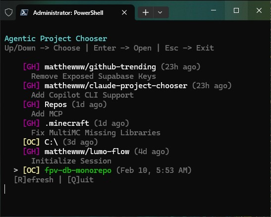

# Agentic Project Chooser

Quick access to your Claude, OpenCode, and Copilot projects from a single `jmp` command.



```bash
jmp
```

## Features

- **Combined view** — all tools merged and sorted by recency (default)
- **Provider badges** — `[CL]` Claude, `[OC]` OpenCode, `[GH]` Copilot in combined view
- **Smart auto-detection** — detects the first available tool with `--auto`
- **Extensible plugin architecture** — drop a `.ps1` file in `providers/` to add a new tool
- **Session browsing** — drill into OpenCode session history per project
- **Result caching** — 5-minute cache per provider for fast startup
- **Copilot session summaries** — shows last session summary under each Copilot project

## Installation

```powershell
.\install.ps1
```

Installs `jmp.bat`, `choose-agentic-project.ps1`, and the `providers/` directory to `~/.claude/bin` and adds it to your user PATH.

Or just run `jmp.bat` directly from the repo without installing.

## Usage

```
jmp                        # Combined view: all tools, sorted by recency (default)
jmp --all                  # Explicit combined mode
jmp --auto                 # Auto-detect a single tool (first found wins)
jmp --claude               # Claude projects only
jmp --opencode             # OpenCode projects only
jmp --copilot              # Copilot projects only
jmp --opencode --sessions  # OpenCode with session browser
jmp --mytool               # Any custom provider registered with id 'mytool'
```

**Keys:** `↑↓` navigate · `Enter` open · `R` refresh · `Esc`/`Q` quit · `B` back (session mode)

## Adding a Provider

Create `providers/mytool.ps1` and call `Register-Provider` with a hashtable:

```powershell
Register-Provider @{
    Id         = 'mytool'
    Name       = 'My Tool'
    Badge      = 'MT'
    BadgeColor = 'Yellow'
    DataDir    = Join-Path $env:USERPROFILE ".mytool\projects"
    CacheFile  = "$env:TEMP\.mytool-projects-cache.txt"
    LaunchCmd  = 'mytool'
    InstallUrl = 'https://example.com'
    GetProjects = {
        param([string]$DataDir, [string]$CacheFile, [int]$CacheMaxAge)
        # Return array of hashtables with: displayName, fullPath, modified, sortDate, type
    }
}
```

The provider is automatically discovered and available as `jmp --mytool`.

## Windows Taskbar App

For a system tray application, see [windows-app/README.md](windows-app/README.md).
