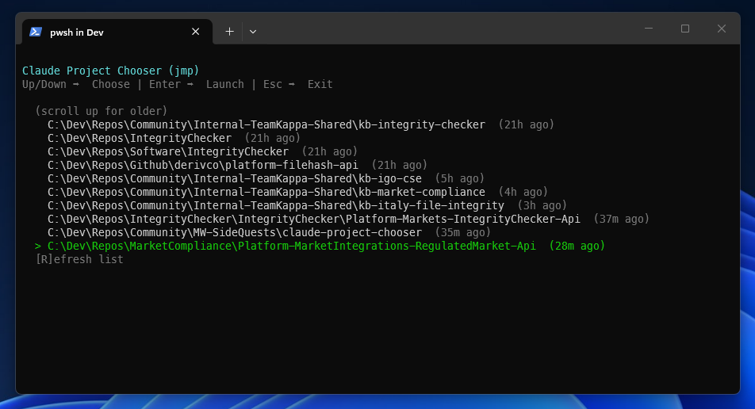

# Claude Project Chooser - PowerShell CLI

[](https://github.com/matthewww/claude-project-chooser/actions/workflows/build.yml)
[](https://github.com/matthewww/claude-project-chooser/actions/workflows/release.yml)
[](https://github.com/matthewww/claude-project-chooser/releases)

Quick access to your Claude Code projects from the command line using PowerShell!



> **💡 Looking for a GUI?** Check out the [Windows Taskbar App](windows-app/README.md) for a system tray application!

## 📟 What It Does

A PowerShell tool that provides an interactive menu for quickly accessing your Claude Code projects.

### Features

- 📁 **Project Discovery** - Lists all your Claude projects from `~/.claude/projects`
- 🎯 **Smart Display** - Shows actual project paths (not the encoded session folder names)
- ⌨️ **Keyboard Navigation** - Navigate with arrow keys for easy selection
- 🚀 **Quick Launch** - Launches Claude Code in the selected project directory in a new PowerShell window
- ⚡ **Fast Performance** - Caches project list for 5 minutes for faster performance
- 🔄 **Easy Refresh** - Press 'R' to refresh the project list anytime

## Installation

#### Quick Install (Recommended)

Run the installer script from the repository root:

```powershell
.\install.ps1
```

This will:
1. Create `~/.claude/bin` directory
2. Copy `jmp.bat` and `choose-claude-project.ps1` to that location
3. Add `~/.claude/bin` to your user PATH
4. Provide instructions for the current session

Then restart PowerShell for the PATH changes to take effect.

#### Manual Installation (Alternative)

If you prefer to install manually:

1. Create the directory: `mkdir $env:USERPROFILE\.claude\bin`
2. Copy `jmp.bat` and `choose-claude-project.ps1` to that directory
3. Add `~/.claude/bin` to PATH (see options below)

##### Adding to PATH via PowerShell (Admin)
```powershell
$binDir = Join-Path $env:USERPROFILE ".claude\bin"
$path = [Environment]::GetEnvironmentVariable('Path', 'User')
$newPath = "$binDir;$path"
[Environment]::SetEnvironmentVariable('Path', $newPath, 'User')
```

##### Adding to PATH via GUI
1. Press `Win + X`, select "System"
2. Click "Advanced system settings"
3. Click "Environment Variables"
4. Under "User variables", click "Edit" on `Path` (or create it if it doesn't exist)
5. Add a new entry: `%USERPROFILE%\.claude\bin`
6. Click OK and restart PowerShell

#### Verify Installation

After restarting PowerShell, run:

```powershell
jmp
```

You should see a menu of your projects with arrow key navigation.

## Usage

```powershell
jmp
```

Then:
- **Up/Down arrows** - Move selection highlight
- **Enter** - Launch Claude Code in that project in a new window
- **R** - Refresh the project list (clears cache)
- **Esc** - Exit the project picker

The tool will:
1. Open a new PowerShell window
2. Change to the project directory
3. Start `claude` session
4. Return to the picker menu so you can launch another project without restarting

This persistent menu lets you quickly switch between multiple projects.

## 🔍 How It Works

The CLI tool:
- Reads project folders from `~/.claude/projects`
- Extracts actual project paths from the `cwd` field in JSONL session files
- Sorts by most recently modified
- Caches results for 5 minutes for better performance
- Launches Claude in a new PowerShell window at the selected project directory

## 📁 Repository Structure

```
claude-project-chooser/
├── choose-claude-project.ps1  # CLI script
├── jmp.bat                     # CLI wrapper
├── install.ps1                 # CLI installer
├── build.ps1                   # Build script for Windows app
├── windows-app/                # Windows taskbar app (see windows-app/README.md)
└── README.md                   # This file (PowerShell CLI docs)
```

## 🚀 Quick Start

```powershell
.\install.ps1
# Restart PowerShell
jmp
```

## 🤝 Contributing

Contributions are welcome! 

- **CLI improvements**: Edit `choose-claude-project.ps1`
- **Windows taskbar app**: See [windows-app/README.md](windows-app/README.md)

## 📝 Notes

- Only shows projects that have valid `cwd` paths in their session data
- Projects without session data are automatically filtered out
- Can run side-by-side with the [Windows Taskbar App](windows-app/README.md) without conflicts
